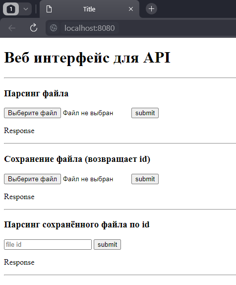
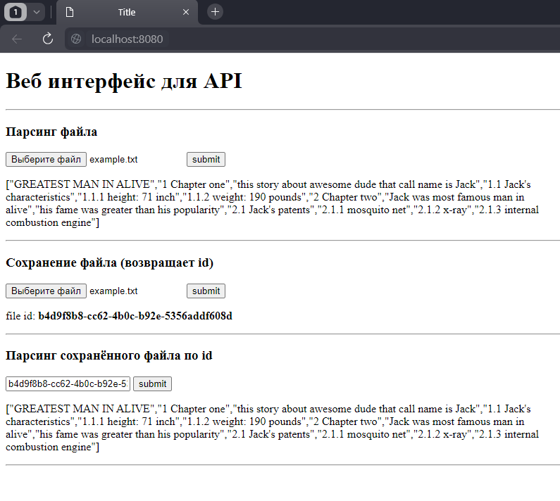

## Запуск
Перед запуском необходимо указать путь сохранения файлов в [application.properties](./src/main/resources/application.properties). 
По умолчанию файлы сохраняются в дирректорию в корне диска D.

## Проверка
Для удобной проверки к API был написан веб-интерфйс, запускающийся на [localhost](http://localhost:8080/).
В веб-интерфейсе отражён весь фнкционал данного REST API.

## Результат
<b>API приводит текстовый файл:</b>

GREATEST MAN IN ALIVE 
#Chapter one 
this story about awesome dude that call name is Jack 
##Jack's characteristics 
###height: 71 inch 
###weight: 190 pounds 
#Chapter two 
Jack was most famous man in alive 
his fame was greater than his popularity 
##Jack's patents 
###mosquito net 
###x-ray 
###internal combustion engine 

<b>К следующему виду:</b>

[ 
"GREATEST MAN IN ALIVE", 
"1 Chapter one", 
"this story about awesome dude that call name is Jack", 
"1.1 Jack's characteristics", 
"1.1.1 height: 71 inch", 
"1.1.2 weight: 190 pounds", 
"2 Chapter two", 
"Jack was most famous man in alive", 
"his fame was greater than his popularity", 
"2.1 Jack's patents", 
"2.1.1 mosquito net", 
"2.1.2 x-ray", 
"2.1.3 internal combustion engine" 
]